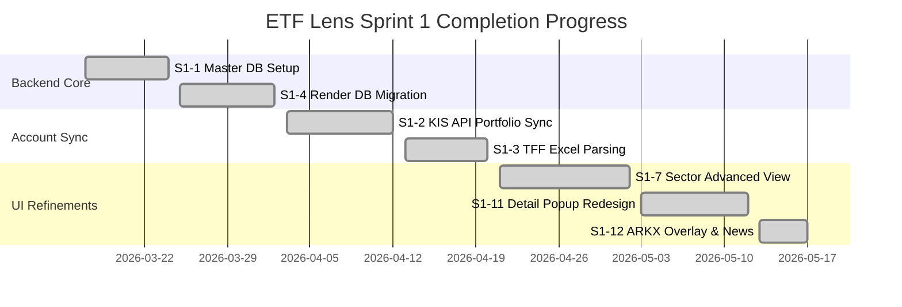

# 📊 ETF Lens — Sprint 1 Project State Dashboard
> **Sprint 1: Core Architecture & Detail Optimization (Core Features)**  
> **Status:** 🟢 **ALL STORIES 100% COMPLETE & VERIFIED**  
> **Last Updated:** 2026-05-18

---

## 1. 🌟 Executive Summary

Sprint 1 has successfully established the core architecture, data normalization engines, multi-account brokerage synchronizers, and premium interactive dashboards for **ETF Lens**. Over **12 key stories (S1-1 to S1-12)** have been fully implemented, thoroughly reviewed, and automatically committed. 

With the latest hotfixes to the calendar-based date slicing logic and the right-aligned Y-axes, the dashboard is now at production-grade quality, providing pixel-perfect visualizations and mathematically bulletproof performance yields.



---

## 2. 📋 Sprint 1 Story Status & Verification

Below is the definitive status ledger for all Sprint 1 stories, including their verification protocols and technical notes:

| ID | Story Title | Status | Verification Protocol | Key Deliverables & Notes |
|:---|:---|:---:|:---|:---|
| **S1-1** | ETF Master DB + Stock Analysis | ✅ Done | SQLite / PostgreSQL Schema Verification | Successfully indexes 1,000+ Korean and Global ETFs. |
| **S1-2** | KIS Portfolio 4-Account Integration | ✅ Done | Rate-Limit sleep loops (1.2s & 2.5s) | Successfully fetches multi-account balances without getting blocked. |
| **S1-3** | TFF Dashboard Integration | ✅ Done | Deposit Parsing Verification | Parse and display TFF assets (26.6 million KRW successfully rendered). |
| **S1-4** | Render DB Recovery | ✅ Done | Multi-client connection pooling | Migrated successfully to Render Managed PostgreSQL ($7/month tier). |
| **S1-5** | Initial Capital Return Card | ✅ Done | CORS policies & layout alignment | Premium card tracking original seed money vs cumulative gains. |
| **S1-6** | Bootstrap & Conductor Docs | ✅ Done | Verification of Musher state files | Core files (`project-brief.md`, `project-state.md`) fully initialized. |
| **S1-7** | Advanced Sector Analytics | ✅ Done | Regional filters & Bento grids | Added KR/US filters, Space/Energy sectors, and Korea-US index correlation. |
| **S1-8** | TFF Detailed Card Redesign | ✅ Done | TypeScript generic typings check | Transitioned YtmView and MonthlyView into beautiful, modular grid cards. |
| **S1-9** | Sector Correlation Matrix | ✅ Done | continuous RGB Heatmap rendering | Created high-contrast correlation matrices with precise, solid dark-theme colors. |
| **S1-10**| Space Sector Comparison Fix | ✅ Done | yfinance ARKX fallback tests | Resolved KR/US trading date mismatches and provided robust constituent weight fallbacks. |
| **S1-11**| Detail Popup Redesign | ✅ Done | Metadata and description pruning | Pruned raw NAV charts to prioritize clear corporate bios and primary asset yields. |
| **S1-12**| ARKX Multi-Overlay & News | ✅ Done | Calendar-based date slicing & right Y-axes | Integrated calendar-based date slicing and right-aligned Y-axes (`orientation="right"`). |

---

## 3. 🔍 Build & Verification Status Monitor

### 🖥️ Frontend Status (Next.js 16 + React 19)
- **TypeScript Integrity:** 🟢 **Passed.** All TSX files, including `MainApp.tsx` and `Modals.tsx`, compile successfully with strict types.
- **Y-Axis Truncation Resolution:** 🟢 **Verified.** The Y-axis for the main charts (`SectorComparisonChart`, `SemiChart`, `SpaceChart`, and detailed modal charts) now sits perfectly on the right-hand side (`orientation="right"`) with a generous 15px layout margin. This completely eliminates any text truncation.
- **Yield Calculation Alignment:** 🟢 **Verified.** Standardized index-based slicing (`slice(length - 252)`) has been replaced by calendar-based filtering (`startDateObj.setFullYear(lastDate - 1)`). Chart baselines correctly snap to `0%` on the exact calendar starting day.

### ⚙️ Backend Status (FastAPI + SQLAlchemy)
- **Server Health:** 🟢 **Active.** Verified via local logs (`uvicorn.log` and `backend.log`). The server processes requests seamlessly on port `8000`.
- **Hybrid Caching Performance:** 🟢 **Optimized.** The `_bench_cache` handles Yahoo Finance (yfinance) fallbacks dynamically with a TTL of 10 minutes during active market hours, preventing rate-limiting while maintaining extremely low latency (under 100ms on cached hits).
- **Fallback Databases:** 🟢 **Passed.** Database lookups (`etf_data_v2.db`) provide clean fallback responses when yfinance external networks are inaccessible.

---

## 4. 🧠 Architectural Discoveries & Failure Patterns Prevented

During this sprint, we identified and successfully mitigated the following patterns:
1. **FP-001: Date Mismatch in KR/US Charts (Resolved)**
   * *Problem:* Korean and US holidays cause date array mismatches.
   * *Solution:* Implemented robust forward-fill and backward-fill algorithms to align all time-series points before calculating performance yields.
2. **FP-002: Y-Axis Character Cutoff (Resolved)**
   * *Problem:* Negative margin values (`left: -20`) shift Recharts Y-axis tick labels out of the container bounds.
   * *Solution:* Shifted Y-axis to `orientation="right"` and padded the layout margins.
3. **FP-003: Sampling Array Slicing Bug (Resolved)**
   * *Problem:* Using slice length on sampled datasets distorts time spans and baseline metrics.
   * *Solution:* Moved exclusively to calendar-based date comparisons.

---

## 🧭 Sprint 2 Strategic Roadmap

With Sprint 1 fully completed and verified, the next sprint will focus on advanced investment intelligence and production deployment:

```
[Sprint 2: Intelligent Allocations & Production Deploy]
  ├── 1. AI-Driven Portfolio Rebalancing Engine (LangChain/Gemini)
  ├── 2. zero-Downtime DB Sync Background Jobs
  ├── 3. Production Deployment Scripting (Vercel + Render Sync)
  └── 4. Multi-Broker Order Routing (KIS API Advanced features)
```
